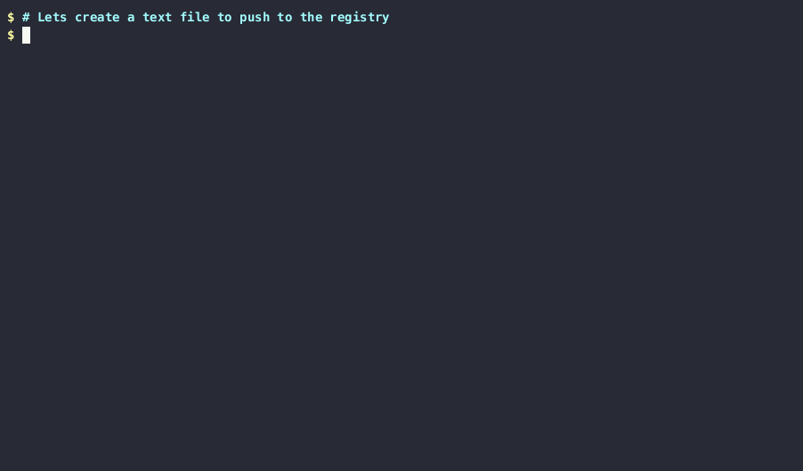

# ORAS demos

This is a collection of demo to show features of [ORAS][oras]. The demo insteracts with a local registry and shows how to push and pull artifacts from it and how to work with referrers.

## Running the demos

### Prerequisites

- [docker](https://docs.docker.com/get-docker/)
- [oras](https://oras.land/docs/how_to_guides/installation)
- [pv](https://ss64.com/bash/pv.html)
- [jq](https://stedolan.github.io/jq/)

 The demo interacts with a test registry that support OCI Artifacts and referrers.

 You can start by running `setup.sh` which will create a local registry and the demos will run against it at `localhost:5000`. The [push](push/demo.sh) is a simple demo that shows how to push an artifact to a registry.

 You can remove the registry by running `reset.sh` which will remove the registry container , named `demo_registry` and all artifacts that have been pushed to it.

## Credits

The demo is based of @thockin's [micro-demos]

[oras]: https://oras.land
[micro-demos]: https://github.com/thockin/micro-demos